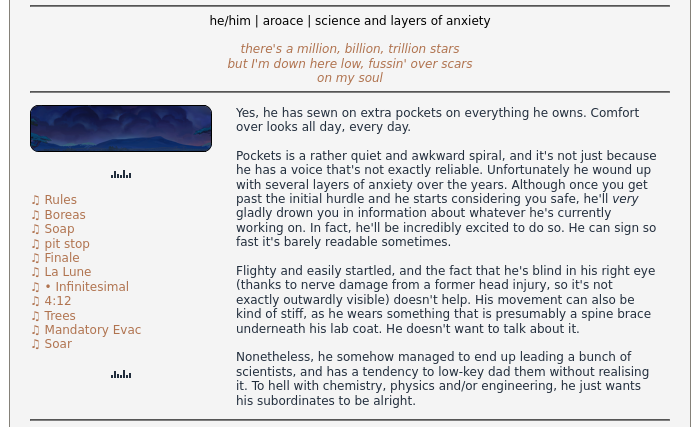
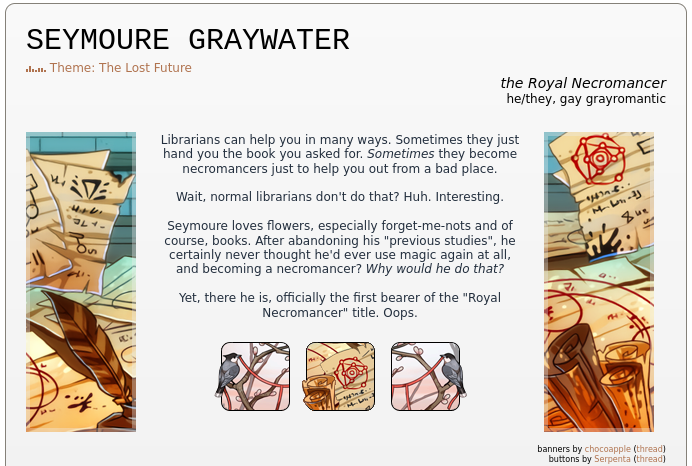

# FR BIO CODES

Free to use/modify on the `flightrising.com` website without credit, however you want, **except** removing already present credit lines for the resources used, if you still use them.

If you wish to credit me, you can either link this repo or just mention Lupik (#277), but this is fully optional.

Current bio templates:
- [Playlist](#playlist)
- [Short three-column](#short-three-column)
- [Longform three-part](#longform-three-part)

## Playlist

[empty code](./code/bio_playlist) | [example in use (!expanded further!)](https://www1.flightrising.com/dragon/61393098)

The image used to stretch the left column is by Stormlord (#139), if you wish to switch it out, their thread is [here](https://www1.flightrising.com/forums/cc/2863041#post_43362535)!

The little soundbars are made by me. You can find speed/colour variants [here](https://airship-full-of-dragons.tumblr.com/post/647881699155443712/lmao-the-middle-brown-one-doesnt-seem-to-work-on).

## Short three-column

[empty code](./code/bio_short_threecolumn) | [example in use](https://www1.flightrising.com/dragon/39572550)

Banners are by Tuath (#260584), thread with more of them is [here](https://www1.flightrising.com/forums/cc/2367442#post_31491468).

Buttons are/icons by Serpenta (#165726), thread with more is [here](https://www1.flightrising.com/forums/cc/1985777#post_1985777), or they can be swapped for any on-site item with FR's item code and will still look nice :)

## Longform three-part

[empty code](./code/bio_longform_threepart) | [example in use](https://www1.flightrising.com/dragon/49093078)

If you wish to switch out the banners, they're made by Tuath (#260584) ([thread](https://www1.flightrising.com/forums/cc/2367442/1#post_31491468)), and shields are by Starkindler (#51686) ([thread](https://www1.flightrising.com/forums/cc/1997330/1#post_22977836)).

If your text runs longer than the banner, it still looks good if you pad it with either item codes or on-site elemental banners, for example.
